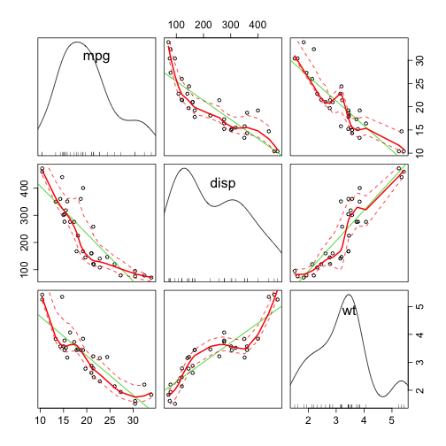

---
title       : Developing Data Products
subtitle    : Course Project
author      : Debsubhra Roy
job         : 
framework   : io2012        # {io2012, html5slides, shower, dzslides, ...}
highlighter : highlight.js  # {highlight.js, prettify, highlight}
hitheme     : tomorrow      # 
widgets     : [mathjax, quiz, bootstrap, interactive] # {mathjax, quiz, bootstrap}
ext_widgets : {rCharts: [libraries/nvd3, libraries/leaflet, libraries/dygraphs]}
mode        : selfcontained # {standalone, draft}
knit        : slidify::knit2slides
logo        : 
biglogo     : 
assets      : {assets: ../../assets}
--- .class #id

<style type="text/css">
body {background:grey transparent;
}
</style>

## Introduction

- This presentation is part of the Course Project for the Coursera Developing Data Products class. The peer assessed assignment has two parts. First, we need to create a Shiny application and deploy it on Rstudio's servers. Second, we should use Slidify or Rstudio Presenter to prepare a reproducible pitch presentation about the application. This presentation adresses the second part of the course project. 

- The app developed for the first part of the assignment is available at:<br> https://d-roy.shinyapps.io/Shiny2/ <br>
- Source code for ui.R and server.R files are available on the GitHub:<br> https://github.com/d-roy/DataProducts
- The current slides deck is available from:<br> https://d-roy.github.io/DDP_Slidify
- Source code of the deck is availabe on the Github:<br> https://github.com/d-roy/DDP_Slidify


--- .class #id

## Select The Best Car For Your Trip App

- This app helps customer to choose a car for his or her trip, using the data from the mtcars dataset from [R].

- First, the customer is required to input the distance of his trip and the price of gasoline in his region. These information will be used to calculate the Gasoline Expenditure for each car in the dataset. Then, customer can enter the maximum amount of money that he  wants to spend on gasoline, and the table shows only the cars that have Miles per Gallon (mpg) that can go below this value.

- Second, the customer can choose some specific characteristics of the cars that he desires: Cylinders, Displacement, Horse Power and Transmission. The table will show only the cars with the filters selected. Customer can sort the table according to the variable he wants by clicking the arrows at the top of the table.

--- .class #id

## The data from the "mtcars" dataset

- The data used for the app comes from the Motor Trend Car Road Tests (mtcars) dataset. The data was extracted from the 1974 Motor Trend US magazine, and comprises fuel consumption and 10 aspects of automobile design and performance for 32 automobiles (1973-74 models). We can explore some of the characteristics of the data:


```r
library(datasets)
head(mtcars)
```

```
##                    mpg cyl disp  hp drat    wt  qsec vs am gear carb
## Mazda RX4         21.0   6  160 110 3.90 2.620 16.46  0  1    4    4
## Mazda RX4 Wag     21.0   6  160 110 3.90 2.875 17.02  0  1    4    4
## Datsun 710        22.8   4  108  93 3.85 2.320 18.61  1  1    4    1
## Hornet 4 Drive    21.4   6  258 110 3.08 3.215 19.44  1  0    3    1
## Hornet Sportabout 18.7   8  360 175 3.15 3.440 17.02  0  0    3    2
## Valiant           18.1   6  225 105 2.76 3.460 20.22  1  0    3    1
```

--- .class #id

## Plot


```r
library(car)
scatterplotMatrix(~mpg+disp+wt, data=mtcars, cex.axis=1.5)
```


